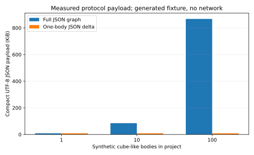

# DB-CAD 纯 JSON 路径对比与工程化评估（2026-09-28）

## 1. 比较对象与证据边界

比较基线是父提交 `1ab2ccf`（2026-09-06，旧 SAT/Bridge 协作逻辑），当前里程碑是 `fd54a8c`（2026-09-27，Mode1 纯 JSON MVP）。用户提供的 9 月 27 日阶段摘要用于定位流程；其中写着“纯 JSON 尚未提交”，描述的是摘要写作时的工作树状态，不能覆盖现在 Git 中已有的 `fd54a8c`。

两条路径的本质区别：旧逻辑的增量提交仍夹带完整 SAT，且按场景还存在单 Body SAT 片段、Bridge 处理或 SAT 回退；新 Mode1 在客户端把 ACIS 拓扑和几何序列化为 JSON，上传变化 Body 的完整拓扑组件，服务器合并成规范图，Neo4j 持久化，接收端从 JSON 重建 ACIS。Mode0 固定为全量 SAT 基线。Mode2 PostgreSQL 增量尚未实现。

下表把证据来源严格分开。**不能把不同场景日志中的大小或本报告的合成 JSON 实验解释为两个 Git 提交的端到端性能提升百分比。**

| 证据 | 已能说明 | 不能说明 |
|---|---|---|
| `git show 1ab2ccf:CAD_DB/log/log_A.txt` | 旧路径一次记录 `fullSat.size=3613`、`delta_sat_segments=1`；旧路径并非纯 JSON | 不能推算每次真实网络字节数、平均耗时、RSS |
| `git show fd54a8c:CAD_DB/log/log_B.txt` | 新路径有 `nodes=60` 与后续 `nodes=4` 的 JSON 重建日志，`sat.size=0` | 与旧日志的模型及阶段不同，不能直接做速度对照 |
| 本目录 `protocol_scaling.py/.csv/.svg` | 同一合成图下，全图 JSON 与单 Body JSON 增量的编码字节数及 Python 合并代价 | 没有 ACIS、HTTP、Neo4j、客户端渲染；也不是旧 SAT 对新 JSON 的基准测试 |

## 2. 可复现实验与图表



脚本构造每 Body 60 节点、59 关系的立方体式拓扑。60 节点参考已提交立方体日志；属性值及关系内容由脚本合成，并非 ACIS 原始模型。对 1、10、100 Body 的同一个模型，只修改 Body 0，分别测量紧凑 UTF-8 全图和完整 Body 组件的编码字节数。`merge_graph` 的 Python 计时和 `tracemalloc` 峰值各重复 15 次，表中为中位数。原始数据见 [CSV](protocol_scaling.csv)，脚本见 [Python](protocol_scaling.py)；在仓库根目录执行 `python CAD_DB/backend/benchmarks/protocol_scaling.py` 可重跑。绝对计时会随机器和 Python 环境变化。

| Body 数 | 全图 JSON | 单 Body JSON 增量 | 增量/全图 | 合并中位耗时 | 合并期间 `tracemalloc` 峰值 |
|---:|---:|---:|---:|---:|---:|
| 1 | 8,735 B | 8,735 B | 100% | 9.478 ms | 174.0 KiB |
| 10 | 86,738 B | 8,735 B | 10.071% | 52.480 ms | 966.9 KiB |
| 100 | 888,188 B | 8,735 B | 0.983% | 513.377 ms | 9,167.3 KiB |

结论很具体：在“只改一个 Body、其他 Body 不变”的实验条件下，Mode1 的**请求载荷**可随改动规模而非整个项目规模增长。但当前服务器合并仍扫描、复制完整基图，合并时间和瞬时 Python 分配随总模型变大。`tracemalloc` 是 Python 被追踪对象的分配峰值，**不是服务器进程 RSS**。100 Body 的 513 ms 已提示合并算法和存储策略需要扩展性优化。没有真实 HTTP 字节、压缩后的传输量、p50/p95 延迟、Neo4j 事务耗时、磁盘字节或服务端 RSS 数据，因此现在不能声称网络传输时间或服务器内存相对旧版提高了多少。

建议正式对照实验固定同一 ACIS 模型集、同一主机与网络、同一 Neo4j 初始状态，在 `1ab2ccf` 和 `fd54a8c` 独立部署并交替运行。场景至少包括首传、修改一 Body、删除、多人冲突、重连和 10/100/1000 Body；每场景预热后运行足够次数，记录原始请求/响应字节、p50/p95、FastAPI 进程 RSS 峰值、Neo4j page cache/事务与磁盘增长、客户端序列化/反序列化/渲染时间及失败率。保留请求 ID、版本 ID 和原始 CSV，以便检查两版确实使用同一输入。当前 Docker daemon 未运行，Neo4j 也没有可访问实例，故该实验尚未执行。

## 3. 本次代码整理范围

- 去掉不再使用的旧 `/delta` SAT 路由、Bridge 客户端方法、C++ 旧 SAT 增量 Push/Pull 与辅助函数；Mode0 的全量 SAT 和读取历史数据的兼容逻辑保留。Mode0 Push 明确走完整 SAT；Mode1 Push、Pull、在线 Ctrl+S 明确走纯 JSON；Mode2 禁用并提示未实现。
- Mode1 打开项目时读取 JSON 最新快照，初始拉取给出完整图；已打开项目的版本模式锁定，WebSocket 订阅显式选择 `mode0`/`mode1`，版本事件按流发送和处理，避免同一数字代表两套版本。SAT 快照不会被误作为 JSON 项目的起点。
- JSON 图组件保留 `serializer_build` 等元数据；Pull 不再返回未使用的完整 `diff`，正确处理“删除后重新创建同 UUID Body”。关系写入按版本与实体 ID 匹配端点；版本创建持有项目节点的事务写锁。保存图哈希供后续完整性核验。
- Neo4j 管理 UI 纳入当前 `JsonGraphVersion/JsonGraphEntity`，管理 API 要求 `CAD_DB_API_PASSWORD`，自定义查询限制为只读、5 秒与 200 行。管理页以及删除/清库路径目前只完成代码审查和离线测试，没有真实 Neo4j UI 操作验证。

## 4. 网络增量与存储增量的区别

目前的 Mode1 是**传输增量、版本存储全量**：每次请求只上传变化 Body 组件，但 FastAPI 读取上一版完整 `content_json`、构建下一版完整规范图；Neo4j 为每版保存完整 JSON 快照，并为该版重建实体节点与关系。版本链可审计、旧版可直接读取，代价是模型大小为 N、版本数为 V 时，存储量接近 O(N×V)，服务器合并和持久化仍接近 O(N)。这解释了为什么图表中的传输体积优势不能直接推断为服务器内存或磁盘优势。

下一阶段建议采用不可变 Body 组件内容寻址（哈希去重）+ 版本到组件的清单 + 周期 checkpoint。一个提交只写变化组件及变更记录；查询最新模型先读最近 checkpoint，再重放有限个 delta。要定义原子提交、引用计数/垃圾回收、迁移、损坏恢复、旧版本重现与校验哈希，并测量读放大和写放大的真实折中。Neo4j 保存版本、拓扑、依赖和溯源关系；大体积几何数组可评估单独压缩对象存储，避免把图数据库当二进制仓库。

## 5. CAD 工程实用性的优先顺序

### P0：正确性与数据安全

1. 建立几何能力矩阵和回环测试：盒体、圆柱、球、布尔、孔、倒角、圆角、样条/NURBS、非流形边界、复杂 shell；对每种检查 ACIS → JSON → ACIS 的 Body 数、拓扑不变量、边界框、体积/面积和几何容差。失败时明确标记不可协作实体，不能悄悄丢面或产生看似可渲染但错误的实体。
2. 制定协议版本协商：`schema`、`serializer_build`、ACIS 版本、单位、坐标系、精度、几何能力集。服务器拒绝不兼容的写入；客户端在重建前检查能力，完整图哈希用于下载校验；增量图不能与完整快照哈希直接比较。
3. 落实版本及冲突语义：当前 Body UUID 是协作稳定根，适合无关联零件的并行改动；跨 Body 布尔、装配引用及同 Body 不同面的改动仍需冲突检测和设计意图层面的合并。对本地脏数据提供保留、分支、重放或人工合并；失败的远端重建必须能回滚本地画布。
4. ACIS 重建、facet 与 OpenGL 更新放到可取消的后台任务，显示进度和失败原因。大模型的反序列化若在 GUI 线程执行，会在网络节省后暴露交互卡顿。

### P1：管理员可用的 Neo4j 能力

管理员 UI 是工程优势，但价值应落在“可解释的项目历史”，不只展示节点数。建议提供：版本链与提交人/时间、每个 Body 的首次出现与各版修改、Body 对特征和装配的依赖影响、拓扑断链定位、版本差异、按权限执行的回滚预览。只读查询可先提供固定模板，并显示关联的模型版本和校验状态。例如当前 schema 下可列版本：

```cypher
MATCH (v:JsonGraphVersion {project_id: $project_id})
RETURN v.version AS version, v.author AS author,
       v.created_at AS created_at, v.graph_hash AS graph_hash
ORDER BY version DESC LIMIT 50
```

也可查看某版 Body 与子拓扑关系。历史变更列表目前包在 `content_json` 中，若要按 Body 高效追溯，应把 `Change` 变为独立可索引节点，并建立 `TOUCHES_BODY`、`BASED_ON_VERSION`、`DEPENDS_ON` 等关系；再做 UI 钻取。管理员身份必须有个人账号、角色授权和审计日志，当前统一 API 密码仅适合受控演示。删除和清库应有二次确认、备份与恢复演练。

### P2：进入真实 CAD 工作流

加入单位、坐标系、尺寸/公差和装配约束作为一等数据；处理 STEP/IGES 导入导出与几何修复；保留特征树、参数、设计意图和外部引用，不能仅依靠 B-Rep 拓扑重建。定义局域网和远程协作的离线缓存、断线续传、权限、项目归档、审计及备份恢复目标。用多用户、十万级拓扑节点的真实项目做稳定性与长期存储增长测试。

## 6. Mode2 的定位和公平评估

Mode2 尚无 PostgreSQL 实现，不应被描述为已经完成。建议让 Mode1 与 Mode2 共用同一个经过版本化的 JSON 协议、相同冲突规则和测试模型，仅更换持久化实现。PostgreSQL 可试 `versions`、`body_components`、`version_body_manifest` 和 `changes` 关系表及 JSONB；Neo4j 可发挥依赖遍历、版本溯源、拓扑诊断的优势。比较同等索引、事务耐久性、缓存、压缩和并发条件下的写入 p95、随机旧版读取、影响分析查询、存储增长、恢复时间和运维复杂度。评估结果可能是混合架构，而非单一数据库胜出。

## 7. 当前验证与未解除的风险

后端测试 `27 passed, 1 skipped`；`compileall` 和 `git diff --check` 通过。跳过的是真实外部环境集成测试。当前机器的 Docker daemon 不运行，未验证 Neo4j 事务、WebUI 交互或端到端网络指标。C++ 最新改动无法在本机重新编译：仓库要求 VS2022 `v143` 和 C++23，现有 VS2019 只有 `v142`。因此 Mode1 重新打开项目和 WebSocket 模式隔离需要在有正确工具链及真实 ACIS/Neo4j 环境中回归验证。当前 Python 合并仍为全图级代价；组件物化、查询索引、checkpoint、回收和恢复演练是下一步最值得实测和优化的瓶颈。

## 8. 本轮已实现的真正增量存储

本轮已将 Mode1 Neo4j 写入改为 `component_manifest_v1`：

- `JsonGraphVersion` 只保存版本、作者、时间、图哈希和变更元数据，不再把完整 `entity_graph` 放入每个版本的 `content_json`。
- 每个稳定 Body 的完整拓扑组件按规范 JSON 的 SHA-256 建立 `JsonGraphComponent`。版本通过 `HAS_COMPONENT` 指向组件；没有变化的 Body 只新增一条清单关系，不复制实体节点。
- 组件内部实体使用 `JsonGraphEntity`，组件内部边使用 `JSON_TO`；跨 Body 的依赖或装配关系使用共享的 `JsonGraphRelation`，版本通过 `HAS_RELATION` 引用。
- `/json-delta` 读取时沿版本清单物化当前图，所以客户端协议不变；旧的历史快照版本仍可读取，作为迁移兼容路径。
- WebUI 的项目详情增加 Mode1 增量存储历史链，展示版本、组件数量、跨组件关系数量、存储模式和时间；单版本详情展示组件哈希、Body 根 UUID、节点/关系计数及 delta 元数据。

这已经实现了“传输增量 + Neo4j 组件级增量存储”的核心语义，但尚不能宣称所有旧数据库已自动迁移、垃圾回收和备份恢复已经完成。上线前需要在真实 Neo4j 上做一次迁移演练，并增加组件引用计数、孤儿组件回收、checkpoint、恢复校验和存储增长测试。
